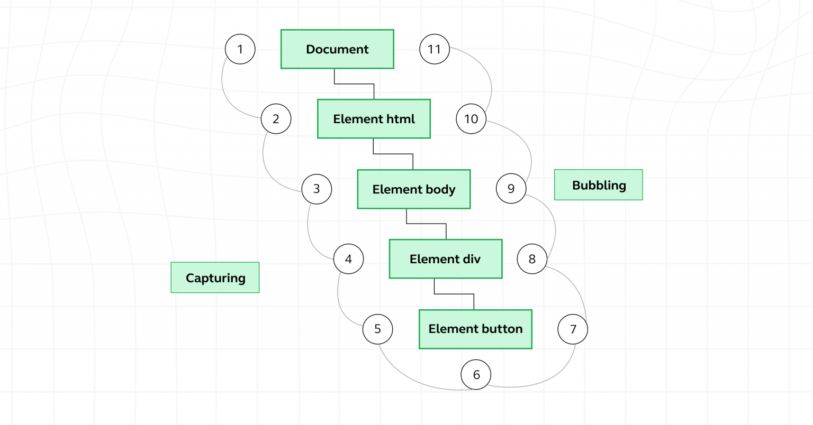
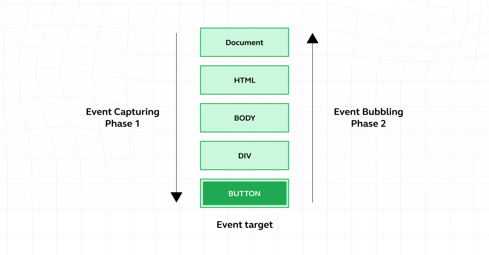
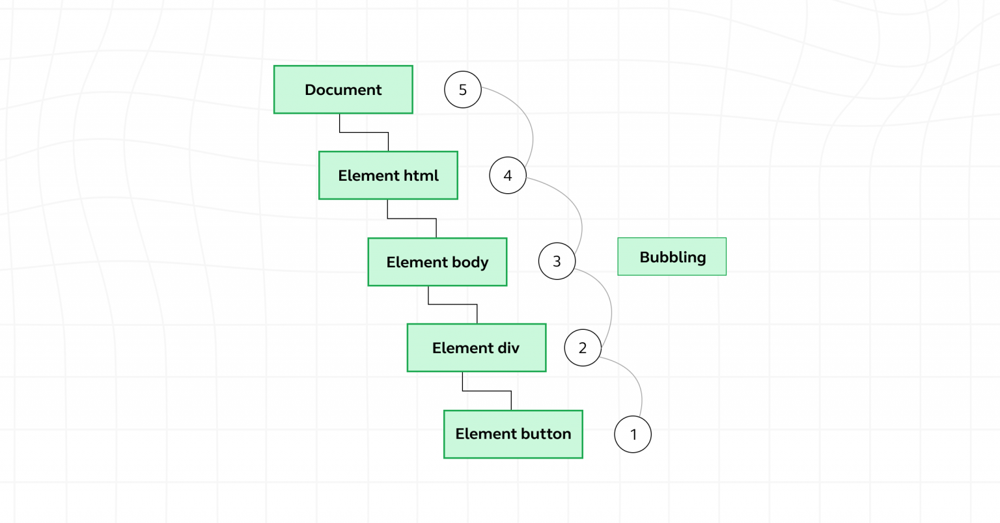

## Comments

-   It is used to explain the code and it will prevent the execution of that code

-   Single Line Comment(//)

-   Multi Line Comment(/\*\*/)

## Variables

-   A variable is a “named storage” for data.

-   we can declare a variable using var,let,const

    -   var

        -   The scope of variables declared with `var`

            -   Variables declared with var can have a global or local scope. Global scope is for variables declared outside functions, while local scope is for variables declared inside functions.

                -   example for globally declared variable

                    ```javascript
                    var number = 50;

                    function print() {
                        var square = number * number;
                        console.log(square);
                    }

                    console.log(number); // 50

                    print(); // 2500
                    ```

                -   example for locally declared variable

                    ```javascript
                    function print() {
                        var number = 50;
                        var square = number * number;
                        console.log(square);
                    }

                    print(); // 2500

                    console.log(number);
                    // ReferenceError: number is not defined
                    ```

        -   It allows for redeclaration and reassignment
        -   variables declared using `var` will be hoisted

    -   let keyword

        -   The scope of variable declared with `let`

            -   Variables declared with let can have a global, local, or block scope. Block scope is for variables declared in a block. A block in JavaScript involves opening and closing curly braces

                -   example for global,local,block scope

                    ```javascript
                    let number = 50;

                    function print() {
                        let square = number * number;

                        if (number < 60) {
                            var largerNumber = 80;
                            let anotherLargerNumber = 100;

                            console.log(square);
                        }

                        console.log(largerNumber);
                        console.log(anotherLargerNumber);
                    }

                    print();
                    // 2500
                    // 80
                    // ReferenceError: anotherLargerNumber is not defined
                    ```

        -   it doesn't allow declaration,but reassign
        -   no hoisting is possible because the variable declared with `let` will be in _Temporal Dead Zone_

    -   const

        -   The scope of variables declared with const

            -   Variables declared with const are similar to let in regards to scope. Such variables can have a global, local, or block scope.

                -   example for global,local,block scoped declaration

                    ```javascript
                    const number = 50;

                    function print() {
                        const square = number * number;

                        if (number < 60) {
                            var largerNumber = 80;
                            const anotherLargerNumber = 100;

                            console.log(square);
                        }

                        console.log(largerNumber);
                        console.log(anotherLargerNumber);
                    }

                    print();
                    // 2500
                    // 80
                    // ReferenceError: anotherLargerNumber is not defined
                    ```

        -   it doesn't support redeclaration or reassignment
        -   no hoisting is possible because the variable declared with `const` will be in _Temporal Dead Zone_

## Data types( 8 basic data types in JavaScript)

-   primitive

    -   They can hold a single simple value.
    -   String:
        -   Textual data.
        -   Example: 'hello', "hello world!", etc.
    -   Number:

        -   An integer or a floating-point number.
        -   Example: 3, 3.234, 3e-2, etc.

    -   BigInt:
        -   An integer with arbitrary precision.
        -   Example: 900719925124740999n, 1n, etc.
    -   Boolean
        -   Any of two values: true or false.
    -   undefined
        -   A data type whose variable is not initialized.
        -   Example: let a;
    -   null
        -   Denotes a null value. let a = null;
    -   Symbol
        -   A data type whose instances are unique and immutable.
        -   Example: let value = Symbol('hello');

-   Non-Primitive
    -   They can hold multiple values. Objects are non-primitive data types.
        -   Object
            -   Key-value pairs of collection of data.
            -   Example:let student = {name: "John"};

## Operators

-   Arithmetic

    -   `+` `-` `*` `/` `%` `++` `--` `**`(Exponent)

-   Assignment

    -   `=`

-   Comparison

| Operator | Meaning                  | Example               |
| -------- | ------------------------ | --------------------- |
| `==`     | Equal to                 | `3 == 5` → `false`    |
| `!=`     | Not equal to             | `3 != 4` → `true`     |
| `>`      | Greater than             | `4 > 4` → `false`     |
| `<`      | Less than                | `3 < 3` → `false`     |
| `>=`     | Greater than or equal to | `4 >= 4` → `true`     |
| `<=`     | Less than or equal to    | `3 <= 3` → `true`     |
| `===`    | Strictly equal to        | `3 === "3"` → `false` |
| `!==`    | Strictly not equal to    | `3 !== "3"` → `true`  |

-   Difference btw (==) and (===) - `==` - only check the value - `===` - check the value and the data type

-   Logical

| Operator | Syntax                       | Description                                                            |
| -------- | ---------------------------- | ---------------------------------------------------------------------- | ------------ | --- | ------------ | ----------------------------------------------------------------- |
| `&&`     | `expression1 && expression2` | Returns `true` only if both `expression1` and `expression2` are `true` |
| `        |                              | `                                                                      | `expression1 |     | expression2` | Returns `true` if either `expression1` or `expression2` is `true` |
| `!`      | `!expression`                | Returns `false` if the expression is `true`, and vice versa            |

## Functions

-   functions are reusable blocks of code designed to perform a specific operation.

    -   Function declaration/Regular Function

        -   A function can be declared using the function keyword.

            ```javascript
            function greet(name) {
                return 'Hello ' + name;
            }
            ```

        -   This type of function can be called before it is defined.

    -   Function Expression

        -   A function can also be stored in a variable.

            ```javascript
            const greet = function (name) {
                return 'Hello ' + name;
            };
            ```

    -   Arrow Functions

        -   Arrow functions provide a shorter syntax and are commonly used in modern JavaScript.

        ```javascript
        const greet = (name) => 'Hello ' + name;
        ```

## First-Class Functions

-   Assigned to variables: As seen with function expressions.
-   Passed as arguments to other functions: Functions can be arguments to other functions, allowing for higher-order functions that operate on other functions.
-   Returned from other functions: Functions can return other functions, enabling the creation of closures

## Scopes

-   refers to the context or environment in which variables are declared and can be accessed.

    -   Global Scope

        -   global scope is the widest scope available. Variables declared in global scope are accessible from anywhere in your code

    -   Local Scope

        -   It is like a private room within a building – it's an enclosed space where variables are only accessible from within that specific room.

    -   Block Scope

        -   It is like a series of nested boxes within a larger container, each with its own set of variables.

## Scope Chain

-   JavaScript looks for variables starting from the current scope and moves outward until it finds them or reaches the global scope.

## Lexical Scope

-   Lexical scope means that a function can use variables that are defined outside it, based on where the function is written in the code.

## Execution Context

-   When JavaScript runs your code, it first creates an execution context. This happens in two phases:

    -   1. Memory Creation Phase

        -   JavaScript scans the code.

        -   Allocates memory for variables and functions.

        -   var variables → initialized as undefined

        -   let and const → allocated memory but not initialized (TDZ)

        -   Function declarations → stored completely in memory

    -   2.  Execution Phase

        -   Code is executed line by line.

        -   Values are assigned to variables.

        -   Functions are executed when called

## What is the Call Stack?

-   To keep the track of all the contexts, including global and functional, the JavaScript engine uses a call stack. A call stack is also known as an 'Execution Context Stack', 'Runtime Stack', or 'Machine Stack'.

-   It uses the LIFO principle (Last-In-First-Out). When the engine first starts executing the script, it creates a global context and pushes it on the stack. Whenever a function is invoked, similarly, the JS engine creates a function stack context for the function and pushes it to the top of the call stack and starts executing it.

-   When execution of the current function is complete, then the JavaScript engine will automatically remove the context from the call stack and it goes back to its parent.

## Hoisting

-   Hoisting is a JavaScript behavior where variable and function declarations are moved to the top of their scope before code execution.

-   Variable Hoisting with var

    -   Variables declared with var are hoisted.

    -   They are initialized with a default value: undefined.

    -   This means you can use them before declaration, but the value will be undefined.

-   Variable Hoisting with let and const

    -   Variables declared with let and const are hoisted.

    -   They are not initialized.

    -   Accessing them before declaration causes a ReferenceError.

-   Function Hoisting

    -   Function declarations are completely hoisted.

    -   You can call a function before it is defined in the code.

-   TDZ (Temporal Dead Zone)

    -   The Temporal Dead Zone is the time between the start of a scope and the point where a let or const variable is declared.

    -   Accessing a let or const variable during this period causes a ReferenceError.

    -   TDZ exists to prevent the use of variables before proper declaration.

## Arrays

-   An array is an object that can store multiple values at once.

-   creation of Array

    -   using assignment operator

        ```javascript
        const names = ['Adarsh', 'Nibras', 'Athul raj'];
        ```

    -   using new Keyword

        ```javascript
        const names = new Array('Adarsh', 'Nibras', 'Athul raj');
        ```

    -   using Array.of()

        ```javascript
        const names = Array.of('Adarsh', 'Nibras', 'Athul raj');
        ```

-   Array Methods Table

| Method Name     | Description                                                |
| --------------- | ---------------------------------------------------------- |
| push()          | Adds one or more elements to the end of an array           |
| pop()           | Removes the last element from an array                     |
| shift()         | Removes the first element from an array                    |
| unshift()       | Adds one or more elements to the beginning of an array     |
| concat()        | Merges two or more arrays                                  |
| join()          | Converts array elements into a string                      |
| slice()         | Returns a shallow copy of a portion of an array            |
| splice()        | Adds or removes elements from an array                     |
| indexOf()       | Returns the first index of a specified element             |
| lastIndexOf()   | Returns the last index of a specified element              |
| includes()      | Checks if an array contains a value                        |
| find()          | Returns the first element that satisfies a condition       |
| findIndex()     | Returns the index of the first matching element            |
| forEach()       | Executes a function for each array element                 |
| map()           | Creates a new array by applying a function to each element |
| filter()        | Creates a new array with elements that pass a test         |
| reduce()        | Reduces the array to a single value                        |
| some()          | Checks if at least one element passes a test               |
| every()         | Checks if all elements pass a test                         |
| sort()          | Sorts the array elements                                   |
| reverse()       | Reverses the array                                         |
| flat()          | Flattens nested arrays                                     |
| flatMap()       | Maps and flattens the array                                |
| fill()          | Fills array elements with a static value                   |
| copyWithin()    | Copies elements within the array                           |
| toString()      | Converts array to a string                                 |
| at()            | Returns element at a specified index                       |
| entries()       | Returns an iterator of index/value pairs                   |
| keys()          | Returns an iterator of array keys                          |
| values()        | Returns an iterator of array values                        |
| Array.isArray() | Checks if a value is an array                              |

## Object literals

-   object literal is the simplest way to create an object—by defining it directly with curly braces {} and key–value pairs.
-   Best suited for creating single or simple objects.

-   Example:

    ```js
    const person = {
        name: 'Alice',
        age: 25,
        greet() {
            console.log('Hello');
        },
    };
    ```

## Object Constructor function

-   An object constructor function is used to create multiple objects with the same properties and methods.

-   It is defined using a function and instantiated using the new keyword.

-   Helps in creating reusable object templates.

-   Example:

    ```js
    function Person(name, age) {
        this.name = name;
        this.age = age;
    }

    const p1 = new Person('Alice', 25);
    const p2 = new Person('Bob', 30);
    ```

## Accessing Object Properties

-   Dot Notation

    -   Access properties using a dot followed by the property name.

    -   Example:

        ```js
        const person = { name: 'Alice', age: 25 };
        console.log(person.name); // Output: Alice
        ```

-   Bracket Notation

    -   Access properties using brackets and a string representing the property name.
    -   Useful for property names with spaces or special characters.
    -   Example:

        ```js
        const person = { name: 'Alice', age: 25 };
        console.log(person['age']); // Output: 25
        ```

-   Object destructuring

    -   A syntax that allows you to extract properties from objects and assign them to variables in a concise way.
    -   Example:

        ```js
        const person = { name: 'Alice', age: 25 };
        const { name, age } = person;
        console.log(name); // Output: Alice
        console.log(age); // Output: 25
        ```

## Map

-   A Map is a collection of keyed data items, similar to an object. However, the key difference (pun intended) is that in a Map, keys can be any type, not just strings. This means you can use objects, functions, and other data types as keys in a Map.

-   Map Methods

| Properties / Methods | Description                                                               | Returns                   |
| -------------------- | ------------------------------------------------------------------------- | ------------------------- |
| `set(key, value)`    | Adds a key/value pair to a Map                                            | Map object (for chaining) |
| `has(key)`           | Checks if a specific key is present in a Map                              | Boolean                   |
| `get(key)`           | Returns a value by key, or `undefined` if the key does not exist          | Value                     |
| `delete(key)`        | Removes a specific element from a Map by the key                          | Boolean                   |
| `clear()`            | Removes all elements from a Map                                           | N/A                       |
| `size`               | Returns the number of items in a Map                                      | Number                    |
| `entries()`          | Returns an iterator for all key-value pairs as `[key, value]`             | MapIterator object        |
| `keys()`             | Returns an iterator containing all keys in the Map                        | MapIterator object        |
| `values()`           | Returns an iterator containing all values in the Map                      | MapIterator object        |
| `forEach()`          | Iterates over the Map elements in insertion order and executes a callback | N/A                       |

## Set

-   A Set is a special collection type that holds unique values. In other words, it ensures that there are no duplicates in the collection. This is especially useful when you need to store data that must be unique, such as user IDs, or to filter out duplicates from a list.

-   Set Methods

| Properties / Methods | Description                                          | Returns            |
| -------------------- | ---------------------------------------------------- | ------------------ |
| `add(value)`         | Adds a new value to a Set                            | Set object         |
| `has(value)`         | Checks for the presence of a specific value in a Set | Boolean            |
| `size`               | Returns the element count of a Set                   | Number             |
| `delete(value)`      | Removes the specified value from a Set               | Boolean            |
| `clear()`            | Removes all values from a Set                        | N/A                |
| `entries()`          | Returns all values in a Set as `[value, value]`      | SetIterator object |
| `values()`           | Returns all elements in a Set (same as `keys()`)     | SetIterator object |
| `forEach()`          | Iterates over the entire Set in insertion order      | N/A                |

## Functions and Functional programming

-   Callbacks

    -   A callback is a function passed as an argument to another function, which is then executed later—usually after some operation is completed.

-   What is a Higher Order Function?

    -   A higher order function is a function that takes one or more functions as arguments, or returns a function as its result.

-   Closures

    -   A closure is a feature in JavaScript where an inner function has access to the outer (enclosing) function's variables and parameters, even after the outer function has returned.

-   IIFE

    -   An IIFE (Immediately Invoked Function Expression) is an idiom in which a JavaScript function runs as soon as it is defined. It is also known as a self-executing anonymous function.
    -   It is usually used to create a local scope to avoid global pollution.

-   Function parameters

    -   Default parameters: function f(x = 10) {}
    -   Rest parameters: function f(...args) {}
    -   Destructuring: function f({ name, age }) {}

## DOM

-   A DOM, or Document Object Model, acts as a translator between Javascript and HTML. It’s not a different programming language but a built-in API for Javascript.

-   Javascript cannot understand HTML elements, which is where DOM comes for help. The Document Object Model (DOM) turns illegible HTML and XML elements into objects, making it easier for Javascript to comprehend and access the material.

## Event

-   JavaScript events are actions or occurrences that happen in the browser, such as a user clicking a button, hovering over an element, or a page finishing loading.

## Event Phases

-   1. Event Capturing
    -   Event capturing is the first phase in the event flow process where the event is captured or detected at the highest level of the DOM hierarchy and then propagates down to the target element. Event capturing allows developers to intercept events before they reach their target, enabling global event handling and delegation. Practical use cases include implementing event delegation, validating user input, and applying consistent event handling across multiple elements.



-   2. Event Targeting

    -   Event targeting, also known as the “at target” phase, occurs when the event reaches the target element that triggered it. During the targeting phase, event handlers attached directly to the target element are executed, allowing for specific actions or behaviors to be applied based on the event.
        

-   3. Event Bubbling
    -   Event bubbling is the final phase in the event flow process where the event, having been processed at the target element, propagates back up through the DOM hierarchy to the root element. Unlike event capturing, which starts from the top of the DOM tree and moves downward, event bubbling starts at the target element and moves upward. Practical implications include simplifying event handling by allowing for more concise code, enabling event delegation, and facilitating the creation of interactive components.


